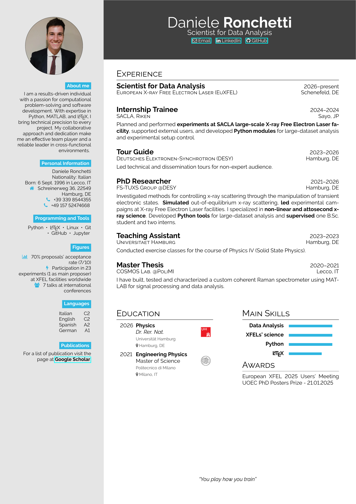

# My One-Page CV

<p align="center">
  <a href="main.pdf">
    
  </a>
</p>

This repository contains my own take of a one-page CV based on the [hipster-cv](https://github.com/latex-ninja/hipster-cv/).

## Usage
To create your own one-page CV simply clone the repository and run the `main.tex` file with a LaTeX engine. The simplest way to get to this result is to use [**Overleaf**](https://overleaf.com).

In overleaf create a new project and upload the `main.tex` file, and the two folders `images` and `simplehipstercv`. Personalize the `main.tex` and add your own logos and pictures needed. Compile it and the job is done.

## Files
```text
├── LICENSE.md 
├── README.md
├── images/           - logos and pictures
├── main-1.png        - preview image
├── main.pdf          - compiled pdf file
├── main.synctex.gz
├── main.tex          - tex source file
├── myBIB.bib         - bib file for highlights papers
└── simplehipstercv/  - class and style files
```


<!-- pdftoppm -png -r 300 main.pdf main -->